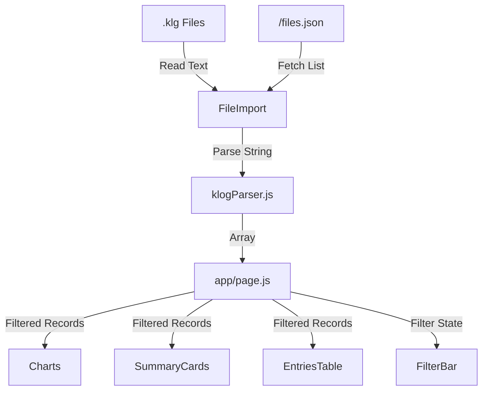

# 🤖 Agents Documentation

This document is designed to help AI agents understand the `klog-dashboard` codebase, architecture, and common tasks. 

## 🏗️ Architecture Overview

The application is a **static Next.js 14** application (React) served by Nginx in a Docker container. It requires no backend for core functionality; all parsing happens client-side.

### Core Components

| Component | Path | Description |
|-----------|------|-------------|
| **Parser** | `src/lib/klogParser.js` | Core logic. Parses `.klg` files into JSON objects (`Record` and `Entry`). Contains aggregation helpers (`aggregateByDate`, `formatMinutes`). |
| **State** | `src/app/page.js` | Main controller. Manages `records`, `filters`, and passes data to sub-components. Uses `localStorage` for persistence. |
| **Import** | `src/components/FileImport.js` | Handles file upload, drag-and-drop, and **Auto-Import**. |
| **Charts** | `src/components/Charts.js` | Renders Chart.js visualizations. |
| **Filters** | `src/components/FilterBar.js` | Manages date range, tag selection, and search. |

### Data Flow

## 🔑 Key Features & Implementation Details

### 1. Auto-Import
- **Mechanism**: The frontend checks for `public/files.json` on mount.
- **Generation**: `docker/entrypoint.sh` runs before Nginx starts. It scans `/usr/share/nginx/html/data` (mounted volume) and generates `files.json` containing paths like `data/mylog.klg`.
- **Frontend**: `FileImport.js` fetches `files.json`, then fetches each file listed, parses them, and adds them to state.

### 2. Time Formatting
- **Standard**: All durations are displayed as `Xh Ym` (e.g., `1h30m`). 
- **Helper**: Use `formatMinutes(minutes)` from `src/lib/klogParser.js`. Do not use manual formatting.

### 3. Filtering Logic
- **Entry-Level**: Search and Tag filters apply to *entries*, not just records. If a record has 5 entries but only 1 matches, only that 1 entry is used for charts/totals.
- **Date-Level**: Date range filters apply to the entire day/record.

## 🛠️ Common Tasks for Agents

### Adding a New Chart
1.  **Aggregation**: Add a helper in `klogParser.js` (e.g., `aggregateByProject`).
2.  **Component**: Add the chart to `Charts.js` using `react-chartjs-2`.
3.  **Formatting**: Ensure tooltips use `formatMinutes`.

### Improving Parser
- The parser regex is in `parseKlog` function.
- It handles standard klog format. If adding support for new klog features, update the regex and `record` object structure.

### CI/CD
- GitHub Actions workflow is in `.github/workflows/docker-build.yml`.
- It builds the Docker image and pushes to GHCR.

## 📝 Conventions
- **Styling**: Vanilla CSS in `src/app/globals.css`. Use CSS variables for colors (Theme variables at top of file).
- **Icons**: Use pure emojis or SVG icons (currently emojis).
- **Deps**: Minimize external dependencies. `chart.js` and `react-datepicker` are the main ones.
