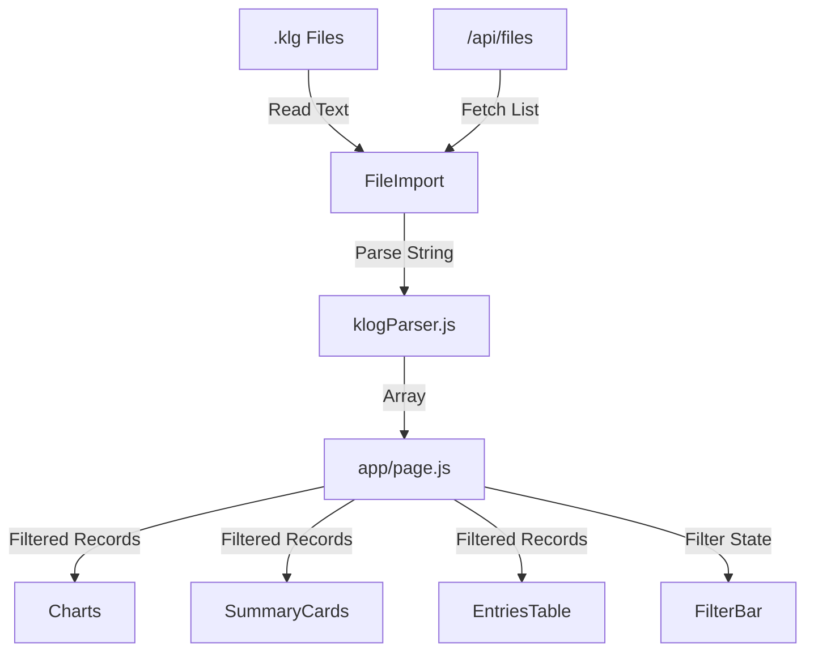

# 🤖 Agents Documentation

This document is designed to help AI agents understand the `klog-dashboard` codebase, architecture, and common tasks. 

## 🏗️ Architecture Overview

The application is a **Next.js 16** app (React 19) running as a **standalone Node.js server** (`node server.js`) in a Docker container. The UI parses klog files client-side; two small server-side API routes expose the mounted data directory and runtime config.

### Core Components

| Component | Path | Description |
|-----------|------|-------------|
| **Parser** | `src/lib/klogParser.js` | Core logic. Parses `.klg` files into JSON objects (`Record` and `Entry`). Contains aggregation helpers (`aggregateByDate`, `formatMinutes`). |
| **State** | `src/app/page.js` | Main controller. Manages `records`, `filters`, and passes data to sub-components. Uses `localStorage` for persistence. |
| **Import** | `src/components/FileImport.js` | Handles file upload, drag-and-drop, and **Auto-Import** (polls `/api/files`). |
| **Charts** | `src/components/Charts.js` | Renders Chart.js visualizations. |
| **Filters** | `src/components/FilterBar.js` | Manages date range, quick date presets, tag selection, and search. |
| **Files API** | `src/app/api/files/route.js` + `[name]/route.js` | Lists and serves klog files from `KLOG_DATA_DIR`. Extension-allow-listed and traversal-protected. |
| **Config API** | `src/app/api/config/route.js` | Exposes runtime config from env vars (`KLOG_DAILY_TARGET_HOURS`, `KLOG_EXCLUDED_TAGS`). |

### Data Flow

```mermaid
graph TD
    Files[".klg Files"] -->|Read Text| FileImport
    AutoImport["/api/files"] -->|Fetch List| FileImport
    FileImport -->|Parse String| Parser[klogParser.js]
    Parser -->|Array<Record>| Page[app/page.js]
    Page -->|Filtered Records| Charts
    Page -->|Filtered Records| SummaryCards
    Page -->|Filtered Records| EntriesTable
    Page -->|Filter State| FilterBar
```

## 🔑 Key Features & Implementation Details

### 1. Auto-Import
- **Mechanism**: `FileImport.js` polls `GET /api/files` every 3 seconds.
- **Server**: `src/app/api/files/route.js` scans `KLOG_DATA_DIR` (mounted volume, default `./data`) and returns each file's `name`, API `path`, and `mtime`.
- **Frontend**: Files that are new or whose `mtime` changed are re-fetched from `GET /api/files/{name}`, parsed, and merged into state — giving near-realtime folder watch.

### 2. Time Formatting
- **Standard**: All durations are displayed as `Xh Ym` (e.g., `1h30m`). 
- **Helper**: Use `formatMinutes(minutes)` from `src/lib/klogParser.js`. Do not use manual formatting.

### 3. Filtering Logic
- **Entry-Level**: Search and Tag filters apply to *entries*, not just records. If a record has 5 entries but only 1 matches, only that 1 entry is used for charts/totals.
- **Date-Level**: Date range filters apply to the entire day/record.

## 🛠️ Common Tasks for Agents

### Adding a New Chart
1.  **Aggregation**: Add a helper in `klogParser.js` (e.g., `aggregateByProject`).
2.  **Component**: Add the chart to `Charts.js` using `react-chartjs-2`.
3.  **Formatting**: Ensure tooltips use `formatMinutes`.

### Improving Parser
- The parser regex is in `parseKlog` function.
- It handles standard klog format. If adding support for new klog features, update the regex and `record` object structure.

### CI/CD
- GitHub Actions workflow is in `.github/workflows/release-please-docker-build.yml`.
- `release-please` opens/merges release PRs; on release it builds the multi-arch Docker image and pushes to GHCR.

## 📝 Conventions
- **Styling**: Vanilla CSS in `src/app/globals.css`. Use CSS variables for colors (Theme variables at top of file).
- **Icons**: Use pure emojis or SVG icons (currently emojis).
- **Deps**: Minimize external dependencies. `chart.js` and `react-datepicker` are the main ones.
