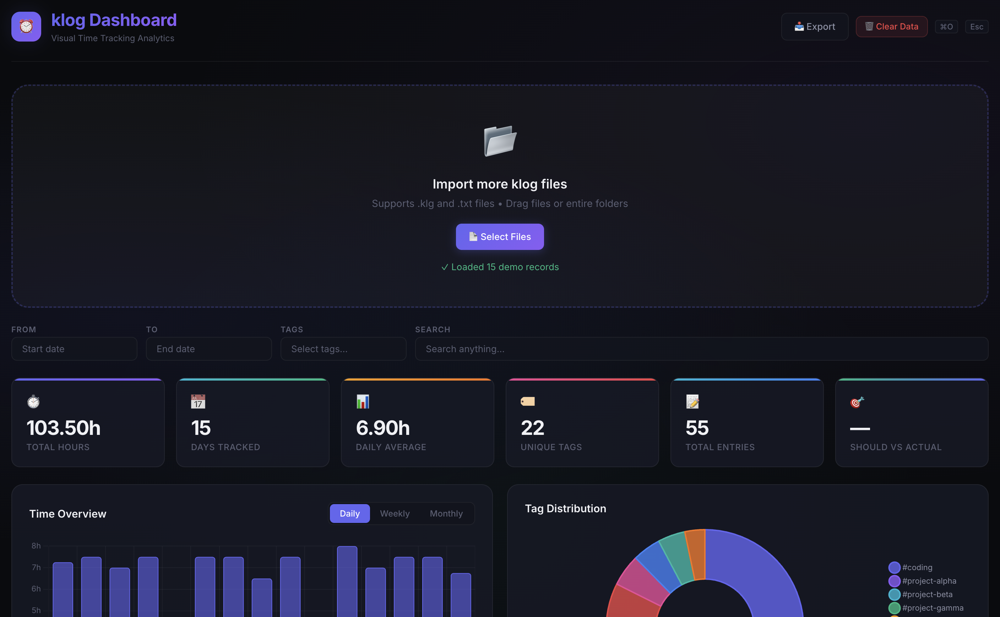

# klog Dashboard 📊



A beautiful visual dashboard for [klog](https://github.com/jotaen/klog) time tracking files. Import your `.klg` files, explore your bookings with interactive charts, and filter by time, tags, or free-text search.

## ✨ Features

- **📂 File Import** – Drag & drop files, supports `.klg`, `.klog`, and `.txt`.
- **🔄 Realtime Folder Watch** – Point to a local folder via `KLOG_DATA_DIR` and see changes automatically.
- **📅 Date Range Filter** – Focus on specific time periods.
- **🏷️ Tag Filter** – Multi-select tags to drill into projects.
- **🔍 Free-Text Search** – Search across all summaries, dates, and file names.
- **📊 Interactive Charts** – Daily/weekly/monthly bar chart, tag distribution doughnut, trend line.
- **🗓️ Activity Heatmap** – GitHub-style contribution heatmap.
- **📋 Entries Table** – Sortable, paginated table of all entries with clickable tags.
- **📈 Tag Breakdown** – Visual bar chart of time per tag.
- **📥 Export** – Export filtered data as CSV or JSON.
- **⚡ Keyboard Shortcuts** – `⌘O` to import, `Esc` to clear filters.
- **💾 Persistent State** – Data saved in localStorage between sessions.
- **✨ Demo Data** – Built-in sample data to explore the dashboard immediately.

## 🚀 Quick Start

### Local Development

```bash
npm install

# Default — watches ./data for klog files
npm run dev

# Point to a custom folder
KLOG_DATA_DIR=/path/to/your/klog/files npm run dev
```

Open **http://localhost:3000**

### Docker Compose (Recommended)

```bash
# Place your .klg files in ./data/, then:
docker compose up -d
```

Dashboard available at **http://localhost:3000**

The `docker-compose.yaml` mounts `./data` into the container and sets `KLOG_DATA_DIR=/data` automatically.

### Docker (Manual)

```bash
docker build -t klog-dashboard .
docker run -p 3000:3000 -v /path/to/klog/files:/data -e KLOG_DATA_DIR=/data klog-dashboard
```

### Using the GHCR Image

```bash
docker pull ghcr.io/muecahit94/klog-dashboard:latest
docker run -p 3000:3000 -v /path/to/klog/files:/data -e KLOG_DATA_DIR=/data ghcr.io/muecahit94/klog-dashboard:latest
```

## 🔄 Realtime Folder Watch

The dashboard watches a configurable directory for `.klg`, `.klog`, and `.txt` files. When a file is added or modified, the dashboard updates automatically within seconds.

| Method | Configuration |
|--------|--------------|
| **Local dev** | `KLOG_DATA_DIR=/path/to/folder npm run dev` |
| **Docker** | Mount a volume to `/data` (see docker-compose.yaml) |
| **Default** | `./data` (if `KLOG_DATA_DIR` is not set) |

> **macOS Note**: If pointing to a folder, your terminal app may need **Full Disk Access** (System Settings → Privacy & Security → Full Disk Access).

## ⚙️ Configuration

The dashboard is configured via environment variables.

| Variable | Description | Default |
|----------|-------------|---------|
| `KLOG_DATA_DIR` | Directory containing `.klg`, `.klog`, `.txt` files | `./data` |
| `KLOG_DAILY_TARGET_HOURS` | Daily work hours target for "Should vs Actual" | `8.0` |

A `.env.example` file is provided for reference. You can copy it to `.env` or set these variables in your shell/docker container.


## 📝 klog File Format

The dashboard parses the [klog file format](https://github.com/jotaen/klog/blob/main/Specification.md). Here's a quick reference:

```
2024-01-15
Project work
    8:00 - 12:00 Morning coding #project-alpha #coding
    -30m Lunch break
    13:00 - 17:00 Afternoon work #project-alpha
    1h30m Code review #review

2024-01-16 (8h!)
    9:00am - 5:00pm Full day #project-beta
```

**Supported entry types:**
- **Time ranges**: `8:00 - 17:00`, `9:00am - 5:00pm`
- **Durations**: `2h30m`, `45m`, `-1h`
- **Open ranges**: `9:00 - ?`
- **Tags**: `#project`, `#tag=value`

## 🏗️ Tech Stack

| Layer | Technology |
|-------|-----------:|
| Framework | Next.js (standalone) |
| Charts | Chart.js + react-chartjs-2 |
| Styling | Vanilla CSS (dark theme) |
| Container | Node.js (Alpine) |
| CI/CD | GitHub Actions |

## 📄 License

[MIT](LICENSE)
